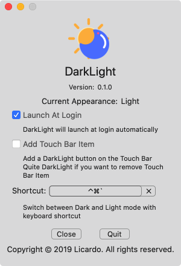
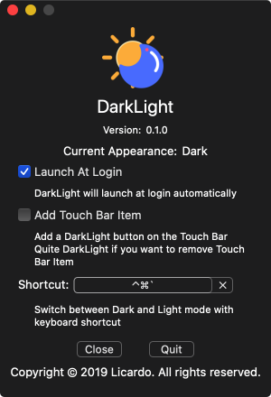

<h1 align="center">Welcome to DarkLight 👋</h1>

> Switch between Dark and Light mode with an ease.

### 🏠 [Homepage](https://github.com/L1cardo/DarkLight)

## Announcement

DarkLight is developed by a medical student, so please kind to me!

## Screenshots

## Features

1. Left click the status bar icon to switch between Dark and Light mode.
2. Right click the status bar icon to open preferences.
3. Use a global keyboard shortcut to switch between Dark and Light mode.
4. Support Touch Bar button to switch between Dark and Light mode.
5. Online update.
6. Current macOS appearance detection.

## Author

👤 **Licardo**

* Website: https://github.com/L1cardo
* Twitter: [@AlbertAbdilim](https://twitter.com/AlbertAbdilim)
* Github: [@L1cardo](https://github.com/L1cardo)

## 🤝 Contributing

Contributions, issues and feature requests are welcome!

## Show your support

Give a ⭐️ if this project helped you!

## 📝 License

Copyright © 2019 [L1cardo](https://github.com/L1cardo).
This project is [MIT](https://raw.githubusercontent.com/L1cardo/DarkLight/master/LICENSE) licensed.
